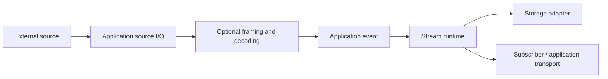

# Event streams — context and motivation

This guide introduces the problem before the architecture. No prior knowledge of event streams, cursors, or databases is assumed. Read the [HLD](hld.md) for system boundaries and the [LLD](lld.md) for implementation contracts. All behavior described for our library is planned, not implemented yet.

## 1. Why do we need this library?

Imagine an application showing a running task. The task produces:

```text
Task started
Downloaded file A
Downloaded file B
Task completed
```

Displaying these messages as they arrive is straightforward. Keeping the display correct when connections drop, messages repeat, the application restarts, or a consumer cannot keep up is harder.

A terminal, agent, workflow, and log viewer all encounter variants of these problems. Without a shared library, each application builds its own buffering, parsing, ordering, persistence, and reconnect logic. Small differences in those implementations can produce missing text, duplicate progress, or a display that disagrees with saved history.

Our event-stream library provides the shared mechanics. Applications still decide what their events mean and where they come from.

## 2. What is an event, and where does it come from?

An event is a record of something observed or something that happened. Examples include a piece of terminal output, a workflow step finishing, a generated text fragment, or a file download reporting progress. An event can contain JSON, text, binary data, or another application-defined representation.

**Application source I/O** means obtaining raw bytes or events from an external source:

| Source | What the application receives | Work before append |
| --- | --- | --- |
| Process stdout or stderr | Byte chunks from a pipe | Frame/decode if needed, assign source identity |
| TCP socket or HTTP response body | Byte chunks | Reassemble the source's framing and decode its format |
| WebSocket | Messages or fragments exposed by the chosen client API | Interpret the application's message format |
| File or tailed log | Bytes plus file positions | Detect record boundaries and handle source rotation |
| SDK callback | An already parsed object | Map it into the application's event schema |
| Application code | A known state transition | Construct the event directly |

The library does not automatically connect to every source or spawn processes. The application obtains input, optionally uses our decoder utilities, and calls `append` with an event. A client receives events through an application transport adapter over a runtime subscription; it does not connect directly to our storage adapter.



## 3. A chunk is not necessarily an event

A source may intend to send two newline-delimited JSON records:

```text
{"text":"hello"}\n
{"text":"world"}\n
```

But reads could return these three chunks:

```text
chunk 1: {"te
chunk 2: xt":"hello"}\n{"text":
chunk 3: "world"}\n
```

Trying to parse each chunk as a complete JSON object fails. One read could also contain hundreds of events. Even the bytes of one UTF-8 character can be split between reads.

**Framing** finds event boundaries. **Decoding** interprets a complete frame. **Semantic mapping** decides what the decoded data means for the application. Our optional utilities handle generic framing and incremental decoding; a provider's event vocabulary or a terminal's screen behavior belongs to a separate application adapter.

The decoder retains incomplete input within a size limit and reports malformed, truncated, or oversized input explicitly. It must produce the same events regardless of how valid input is divided into chunks. Already parsed SDK objects can bypass this step.

## 4. What is a stream?

A stream is an ordered history of related events, identified by an application-selected name or ID. One task might have one stream; another application might use one stream per terminal or workflow.

A stream is not the network connection carrying it. The connection can disappear and be replaced while the persisted stream remains. Two screens can independently read the same stream and be at different positions.

The application chooses the grouping. Our library orders events within each stream; it does not establish a global order across unrelated streams.

## 5. What is a cursor?

A cursor is a bookmark identifying a position in committed stream history. For teaching purposes, imagine a stream with these numbered records:

| Position | Event |
| --- | --- |
| 1 | Task started |
| 2 | Downloaded file A |
| 3 | Downloaded file B |
| 4 | Task completed |

If your application has applied event 2, it can request **events after cursor 2** and receive events 3 and 4. “After” is exclusive: event 2 is not included.

Position 0 means before the first record. Starting there replays the whole available history. Starting at the current tail deliberately skips existing history and follows only future records.

The store also reports `resume_floor`: the earliest bookmark from which it can guarantee complete replay. With all history available, that floor is 0. If a future retention feature deletes records 1 through 3, the floor becomes 3. You can then request `after=3` and receive records 4 onward. Record 3 itself does not need to exist because replay starts **after** the bookmark.

A request for `after=2` would need record 3, so it must return `history_unavailable`. Silently starting at record 4 could leave the consumer with incorrect state. V1 does not delete history; this explains how the boundary is defined. The [LLD's replay examples](lld.md#replay-boundaries-by-example) show complete, deleted, and empty history, including valid and invalid requests.

Real cursors also identify the stream and its **incarnation**: a particular lifetime of that stream. If a stream is recreated, an old bookmark must not accidentally point into the new history. Normal durable restart preserves the incarnation. The cursor is encoded losslessly and should be treated as an opaque token by client applications.

A timestamp is not a reliable replacement: several events can share a timestamp and clocks can disagree. A socket message number is also insufficient if it resets on reconnect. A parser's local counter describes parsing progress, not a successful database commit. Our committed cursor is assigned through the storage transaction.

## 6. Reconnect, replay, and live delivery

Suppose your UI applies events 1 and 2, then loses its connection. Meanwhile the producer commits events 3 and 4. When the UI reconnects, it asks for events after its last applied cursor, 2.

```text
Producer:    commit 1 → commit 2 → commit 3 → commit 4 → commit 5
UI:          apply 1  → apply 2  → disconnected
Reconnected UI:                    replay 3 → replay 4 → follow 5
```

**Replay** reads events already committed. **Live delivery** follows subsequent commits. Switching between the two needs coordination: an event could otherwise arrive after the historical query but before live listening begins and disappear through that gap.

Our runtime registers the subscriber and captures a committed boundary together. It replays through that boundary, then follows later records. Storage supplies the records in both phases; notifications tell a reader to check for more data. The LLD defines the synchronization needed to avoid missed wakeups.

## 7. Delivered is different from applied

The library can yield event 3, but the UI might crash before updating its display state. Saving cursor 3 before applying it would cause reconnect to skip work that never happened.

A **projection** is state built by applying events: a transcript, task status, or progress view. A **checkpoint** records how far that projection has been successfully built. Save the projection and checkpoint consistently. If the checkpoint survives but the projection does not, the bookmark alone is insufficient.

For example, applying two text deltas `hel` and `lo` builds `hello`. Reapplying the second delta incorrectly creates `hellolo`. An application may see a record again after reconnect and must use its applied checkpoint or another suitable deduplication strategy.

If the display state exists only in memory and the UI reloads, rebuild it from history. A saved cursor cannot reconstruct the missing display state. The library delivers records; it does not know whether application processing succeeded.

## 8. Event IDs and cursors solve different problems

An **event ID** is a stable retry identity supplied by the producer. A **cursor** is the committed position assigned by the stream/store.

Consider this sequence:

1. Producer submits event `download-B-finished`.
2. Storage commits it at cursor 3.
3. The response is lost before the producer receives it.
4. Producer retries using the same event ID and bytes.

Our library returns the existing event at cursor 3 instead of inserting another event. This behavior is called **idempotency**: repeating the same append has the same stored effect as doing it once.

If the producer reuses that ID with different bytes or a different schema, the library reports a conflict. If it creates a fresh ID for every retry, the library cannot know that two submissions describe the same observation.

This does not make external actions exactly once. Recording “send email requested” and sending the email are separate operations. A crash between them requires application-specific handling and, where possible, idempotency support from the external service.

## 9. Why commit before publishing?

A **commit** is the storage operation that makes the record part of accepted history according to the adapter's guarantees. Inserting the record, recording its retry identity, and advancing the stream cursor must happen atomically: all succeed together or none does.

If a UI sees “task completed” before the corresponding record commits, a crash could leave the UI having displayed an event that saved history does not contain. Our runtime only publishes committed records.

Storage choice determines what survives failure. A memory adapter loses history when its store instance disappears. A durable adapter recovers according to its documented persistence profile. Process-crash recovery and power-loss durability are distinct claims and need different evidence.

When a write's outcome is uncertain, the library cannot honestly say it failed without committing. It reports uncertainty and resolves the original event identity before continuing the affected write sequence. Applications keep the same ID for retries.

## 10. What if events arrive faster than they can be handled?

Queues absorb short bursts, but an unlimited queue under sustained overload eventually exhausts memory.

**Backpressure** means making the upstream producer wait when downstream capacity is full. Our runtime bounds admitted records and bytes, storage work, replay pages, decoder buffers, and subscriptions. Callers can wait within a deadline or request immediate rejection when capacity is unavailable.

A slow subscriber does not receive an unlimited private copy of live history. If it exceeds its lag budget, the runtime terminates that subscription with an explicit error. The application may reconnect from its last applied checkpoint. Reconnecting alone will not help if the consumer remains permanently slower than the producer.

Some sources cannot pause safely. The application must then choose a bounded spool, stop the source, or explicitly accept loss. The library cannot turn unlimited incoming data into unlimited reliable storage. Likewise, disk-full errors stop new durable writes; v1 does not silently delete old history.

## 11. Why one runtime owner per store?

Many producers and subscribers can share one runtime through cloned handles. However, a second independent runtime cannot open the same store concurrently in v1.

This gives one place to coordinate writes, subscriber wakeups, and recovery. Without it, a second writer could commit an event while the first runtime's subscribers remain unaware. Multiple independent writers require additional coordination that v1 does not implement.

Different stores can have different owners. After the owning process exits and ownership is safely acquired again, a new runtime can recover the durable store. This is restart recovery, not a distributed failover system.

## 12. Problems, responses, and remaining responsibilities

| Problem | Planned library response | Application responsibility |
| --- | --- | --- |
| Input split across reads | Bounded incremental framing/decoding | Choose the source format and semantic mapping |
| Invalid or oversized input | Typed decoder failure | Decide whether to stop or explicitly resynchronize |
| Concurrent appends | Committed ordering within a stream | Choose stream grouping and any domain ordering rules |
| Lost append response | Stable-ID deduplication and outcome resolution | Preserve event ID and identical retry input |
| Connection loss | Exclusive-cursor replay and ordered follow | Reconnect through its transport adapter |
| Duplicate application processing | Expose stable record identity and cursor | Apply/checkpoint state consistently |
| Slow reader | Bounded pages and explicit lag termination | Catch up or adjust consumption strategy |
| Disk full or failed commit | Reject/fault explicitly; no uncommitted publication | Restore capacity and decide whether sources can wait |
| Process crash | Recover committed records with a durable adapter | Restart sources and reconstruct application state |
| Bytes lost before commit | No fabricated recovery | Use replayable sources/checkpoints or a future raw-input journal |
| Wrong/ahead/unavailable cursor | Explicit error with relevant bounds | Investigate or rebuild; never assume skipped history is safe |
| Internet outage | Local storage can still accept local events | A remote source may itself stop producing |

## 13. Planned storage: SQLite behind an adapter

We plan to build `SqliteStore` using the official SQLite engine through a Rust binding. The binding lets Rust call SQLite; it does not replace SQLite with a new database implementation. The binding package and bundled-versus-system packaging choice will be selected during implementation.

SQLite provides transactions for storing related changes together. Our adapter uses them to save the record, its retry identity, and the updated cursor as one operation. SQLite's [transaction documentation](https://www.sqlite.org/transactional.html) explains the underlying guarantee. Our adapter still needs testing for its own transaction usage, configuration, and error handling.

Database locking and runtime ownership serve different purposes. SQLite coordinates database access, while our v1 adapter also prevents two independent stream runtimes from owning the same store. That runtime rule keeps event ordering policy and subscriber notifications coordinated even if the database could accept another connection.

The database stores history. Our runtime supplies subscriptions, admission limits, cursor validation, and the public stream API. Applications can inject another conforming store without changing their event vocabulary. The [LLD storage plan](lld.md#22-sqlite-adapter-implementation-plan) describes the adapter work and release gates. Moving data to the cloud later requires an explicit replication design; changing the database adapter is not automatic offline synchronization.

## 14. Reading the design documents

- [ADR 0001](adr.md): the architectural decision and its scope.
- [HLD](hld.md): components, ownership, principal flows, guarantees, and delivery stages.
- [LLD](lld.md): precise data contracts, algorithms, storage and decoder mechanics, limits, errors, and tests.

The aim is a reusable foundation for trustworthy event history and delivery. It handles the recurring stream mechanics while applications retain control over their sources, event meanings, and external actions.
