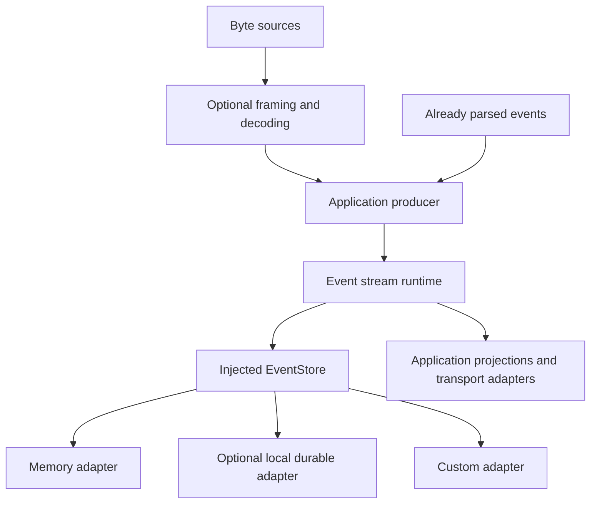

# Generic event stream — high-level design

- **Status:** proposed; no runtime implementation; dependency packages and versions remain to be selected.
- **Date:** 2026-09-04.
- **Decision:** [ADR 0001: Reusable event streams](adr.md).
- **Background:** [Event streams, cursors, and common failure scenarios](context.md).
- **Implementation design:** [Low-level design](lld.md).
- **Delivery sequence:** [Ordered ADR roadmap](../README.md).
- **Resource design:** [First-principles performance](performance.md).

## Purpose and context

Build a standalone Rust library that gives applications reliable event ingestion, ordered persistence, replay, and live subscriptions. Terminal output, workflow progress, agent output, logs, and UI updates repeatedly need these mechanics. Applications should reuse them through a small stream API and supply their own storage and payload semantics.

This proposal originated during Nessa's session protocol review. The important conclusion was to separate reusable stream mechanics from application protocols: socket counters and parser counters cannot serve as durable replay cursors, replay does not resume an external process, and event deduplication does not make external actions exactly once. Those conclusions are documented locally here and in the LLD; no discussion history is needed to understand the design.

ADR 0001 records this repository's foundational decision. `001-event-stream` contains that ADR and its context, HLD, LLD, and performance design. Later decisions each have their own numbered folder.

## System architecture

| Component | Owns |
| --- | --- |
| Application producer | Application source I/O, event meanings, stable retry IDs, semantic normalization |
| Optional decoding layer | Bounded incremental framing and decoding of arbitrary byte chunks |
| Stream runtime | Admission, ordering policy, append, replay, subscriptions, backpressure, lifecycle |
| Storage adapter | Atomic commits, cursor allocation, deduplication index, ownership, persistence and recovery |
| Application consumer | Applying records, saving matching projection/checkpoint state, network delivery and authorization |

**Application source I/O** — obtaining raw bytes/events from external sources such as process stdout, sockets, files, WebSockets, or HTTP streams.

Applications inject an `EventStore` implementation at construction. Consumers read through the runtime. Core records contain versioned opaque payload bytes; provider SDKs, terminal emulators, Nessa schemas, and network frameworks are not core dependencies.

## Principal flows

**Append:** a producer submits an event with a stable retry ID. The runtime admits it within resource limits and serializes writes for its stream. The store atomically checks identity, allocates ordering, and commits. Only then can the runtime acknowledge the record and make it available to subscribers. An identical retry returns the original record; conflicting input fails.

**Replay and follow:** a consumer supplies an exclusive cursor. The runtime captures a committed boundary, reads history through that point, and continues with later commits in order. Committed storage supplies records for both phases; notifications only wake readers. Reconnecting consumers resume from the checkpoint corresponding to their applied state.

**Byte ingestion:** an optional decoder accepts partial or multiple frames across arbitrary chunks. The producer maps decoded items to appendable events. Storage backpressure propagates toward the source. Already parsed events bypass this layer.

## Guarantees and fault model

Records are immutable and ordered within a stream incarnation. There is no ordering promise across streams. Cursors distinguish incarnations so stale positions cannot address a recreated stream. Missing history, invalid cursors, conflicting retries, malformed input, and lagging consumers produce explicit errors.

V1 has one exclusive runtime owner per store, shared by multiple producers and consumers. This supports a tractable consistency and restart model. It does not provide distributed availability or automatic failover.

Persistence guarantees depend on the selected adapter and are declared at open. Memory storage is ephemeral. A durable adapter must demonstrate its stated transaction, ownership, flush, and recovery guarantees. A storage failure never causes fallback to publishing uncommitted events. Uncertain append outcomes are resolved using the original event identity.

Recovery covers committed records. Bytes not yet committed, parser state, external processes, and external side effects require application-specific recovery. Consumers advance checkpoints only with their corresponding applied projection state.

## Performance and resource strategy

Correctness and bounded resource use come first. Bound append admission, active operations, subscriptions, replay pages, decoder buffers, and caches. Backpressure or explicit rejection handles overload. Slow consumers can be disconnected and replay later without retaining unlimited live-event buffers.

Use per-stream coordination, indexed storage access, shared immutable bytes where useful, and coalesced notifications. Storage latency remains part of commit latency. Persistent history grows in v1 and eventually reaches capacity; it is never silently deleted to maintain throughput.

Treat CPU and memory as budgets, not incidental implementation details. Start with standard data structures and one clear owner for each operation. Measure allocations, copies, retained capacity, scheduling, database page changes, and the actual operating-system write/flush path. Keep an optimization only when its measured benefit justifies its added state and failure cases.

Benchmark append and delivery latency, throughput, replay, parsing, memory, fairness, and restart behavior under mixed workloads before setting release budgets. Performance claims must identify hardware and durability settings. The [LLD](lld.md) defines the benchmark and failure-test matrices.

## Initial scope and extension boundaries

V1 includes the core API, a memory adapter, one optional validated local durable adapter, custom storage and decoder interfaces, bounded replay/live delivery, and generic framing utilities. Local storage lets applications commit without internet access; external consumers can choose an ephemeral configuration.

Application commands, authentication, provider normalization, terminal emulation, and transport servers remain outside the crate. Replication, multi-writer support, consumer groups, retention, snapshots, and crash-resumable parser checkpoints are deferred. Cloud synchronization needs a separate design; changing a storage destination does not implement it.

The [roadmap](../README.md) turns this follow-on work into ordered decisions and completion gates. Lifecycle, snapshot recovery, retention, parser recovery, and single-origin replication are planned phases. Distributed writers and consumer groups remain explicit decision gates. Optional terminal and agent companions require their own reviewed contracts.

Plan `SqliteStore`, using the official SQLite engine through a Rust binding, as the first optional durable adapter. Its implementation must pass the ownership, transaction, recovery, and performance gates in the [LLD](lld.md#22-sqlite-adapter-implementation-plan) before release. The core remains storage-independent; executor selection remains open.

## Delivery and acceptance

Build the executable contracts and memory implementation first, including a generic consumer that has no Nessa dependency. Add incremental decoding and then validate a durable adapter. Run concurrency, replay/live race, overload, parser fuzzing, ownership, and restart tests before optimizing measured bottlenecks.

Release requires all adapters to pass the shared contract suite, adapter-specific durability evidence, reproducible performance results, and working custom-store, decoder, and reconnect examples. Concrete types, storage operations, synchronization, errors, resource accounting, and acceptance scenarios belong in the [low-level design](lld.md).
