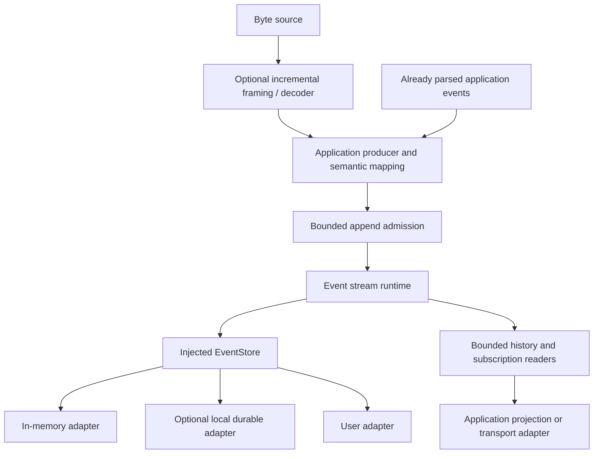
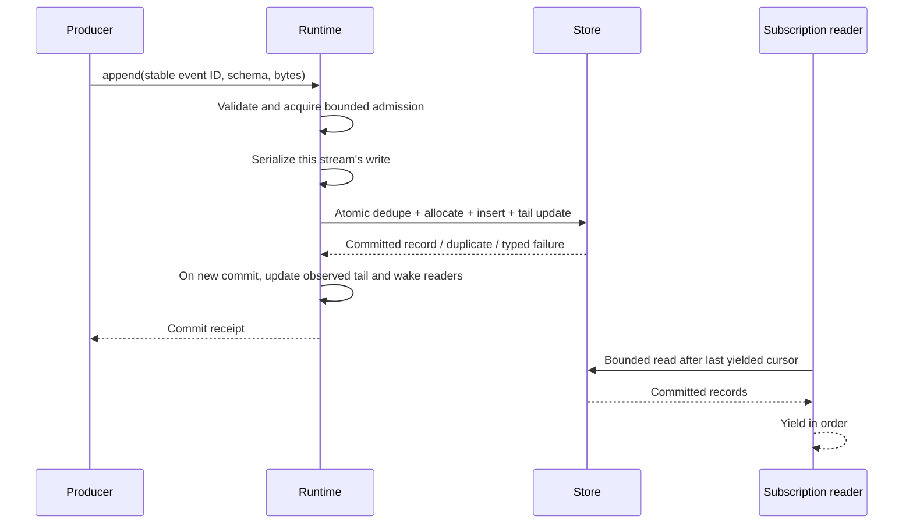

# Generic event stream — low-level design

- **Decision status:** accepted for implementation.
- **Execution status:** in progress; see [current evidence and remaining gates](completion-audit.md). The implementation uses Tokio and the official SQLite engine through optional rusqlite.
- **Date:** 2026-09-04.
- **Background:** [Event streams and cursors explained](context.md).
- **Architecture:** [High-level design](hld.md).
- **Decision record:** [ADR 0001: Reusable event streams](adr.md).
- **Implementation sequence:** [Ordered ADR roadmap](../README.md).
- **Resource detail:** [First-principles performance design](performance.md).
- **Scale review:** [Agent populations, current costs, and stress profiles](scale-review.md). The 10,000/100,000-agent targets require separate evidence for idle subscriptions, active traffic, and overload.
- **Scope:** a standalone Rust library that accepts events within limits, saves them in order, and supports replay and live delivery. Storage is replaceable. Incremental decoding is optional.

This LLD explains how the proposed library should work. It covers APIs, algorithms, storage, failures, resource limits, and tests. The source now implements the core APIs, adapters, and decoder path. The Rust examples in this design remain illustrative; the public source contracts and runnable examples define exact signatures. Completion still requires the acceptance and performance evidence below.

The ADR records the decision. The HLD explains the architecture. This document supplies implementation detail. SQLite is the chosen database engine. The current binding and executor are selected in Cargo.toml. Their compatibility and release evidence are tracked in the completion audit.

## 1. Intended outcome

Applications should be able to supply a store, append events, and replay or follow them through one library. They should not have to rebuild ordering, retry handling, reconnect logic, and buffer limits for every project.

The same API should work for terminal output, workflows, logs, agent output, and UI updates. The application defines what those events mean.

“Fast and stable” means that commits and delivery are measurable and efficient. Memory stays within configured limits when work arrives too quickly. Failures are explicit. Committed history can be recovered according to the chosen store's persistence guarantees.

We will measure performance before promising a throughput target. Each adapter must state which failures it can recover from.

The default architectural priorities are:

1. Preserve committed history and ordering under concurrency and failure.
2. Keep resource use bounded and overload visible.
3. Make the library independently useful with custom stores and decoders.
4. Reduce allocation, copying, contention, and storage round trips without weakening those guarantees.
5. Make diagnosis, replay, compatibility, and recovery predictable.

### Product direction and release scope

The product should let applications manage reliable event history over its full lifecycle: create it, append and replay it, recover it after failure, and eventually manage its size or retire it. The same record and cursor rules must remain understandable as these capabilities are added.

This document uses three labels:

- **Product rule:** behavior that must remain true across releases, such as rejecting a cursor from another stream incarnation.
- **Planned later:** intended product behavior beyond the first release. The direction is described here, but exact APIs and delivery dates need a follow-up design.
- **Open exploration:** a possible capability that has not been selected for the product. Its presence here is not a promise to implement it.

**V1 scope:** build the reliable append, read, follow, and restart foundation first. V1 keeps complete history, uses one runtime owner per store, and supports memory or SQLite storage. Later capabilities must preserve the guarantees this foundation establishes.

### Scope boundaries

| Area | Included in the v1 library | Application / integration responsibility | Beyond v1: direction and status |
| --- | --- | --- | --- |
| Ordering | Per-stream ordered immutable records and exclusive cursors | Choose stream grouping and domain-level sequencing | Open exploration: cross-stream ordering and atomic multi-stream writes |
| Retries and effects | Atomic append deduplication and commit receipts | Stable retry IDs, command deduplication, tool execution, and reconciliation of external side effects | None specified; exactly-once external effects are not a promised future stream feature |
| Delivery | Bounded history reads and replay-to-live subscriptions | Network servers, WebSocket/SSE delivery, authentication, applying records, and projection checkpoints | Open exploration: consumer groups and saved acknowledgement positions |
| Storage and ownership | In-memory store, optional SQLite adapter, and exclusive runtime ownership | Select/configure storage and manage application deployment | Open exploration: distributed writers, consensus, and automatic failover |
| Parsing and sources | Optional generic framing and custom decoder seam | Source I/O, provider normalization, terminal emulation, and process supervision through application code or integration adapters | No domain adapter committed to the roadmap by this table |
| Capacity and history | Explicit overload, parser, storage, and history errors | Choose limits and respond to failures or exhausted capacity | Planned later: explicit delete/reset, opt-in retention, snapshot-based recovery, compaction, and replication |
| Recovery | Recovery of committed records according to adapter capability | Restart/reconnect sources and reconcile application state; obtain source replay when available | Planned later: safe restore, optional parser checkpoints, and a raw-input recovery path |

**Application / integration responsibility** means work outside the generic core. Reusable adapters can provide that work; consumers do not have to implement everything themselves. This table does not schedule terminal or agent-specific packages.

Beyond-v1 entries distinguish the intended roadmap from open exploration. Planned behavior needs implementation detail and acceptance tests before it can ship. No recovery mechanism can recreate source output that was never observed or saved.

Applications choose whether history must survive restart. An in-memory store is valid, but its history lasts only as long as that store instance. An application that must write without internet access should select local storage. A remote store does not automatically provide offline operation.

## 2. Architecture and ownership



Each layer has a clear job:

- The runtime accepts work within limits, orders each stream's appends, and manages reads and subscriptions. It reports public errors.
- The store saves records, assigns cursors, and checks retry IDs in one transaction. It enforces ownership and recovers saved history.
- The application obtains source bytes or events, assigns stable event IDs, and defines event meanings. It also manages consumer checkpoints, transports, and authorization.

Consumers read through the runtime so every adapter provides the same stream behavior. A decoder handles input only. It does not receive a store handle or assign a committed cursor.

The core does not require a provider SDK, terminal model, Nessa type, or transport framework.

### Modules

Admission means accepting a write only after reserving a queue slot and enough bytes for it. The table uses this name for the runtime capacity check. A codec is a framing or decoding utility.

| Module | Responsibility |
| --- | --- |
| Record types | Stream identity, incarnation, event ID, schema reference, cursor, bounds, errors |
| Runtime | Lifecycle, admission, append coordination, reads, subscriptions, limits |
| Store contract | All-or-nothing operations, ownership lock, supported guarantees, shared contract tests |
| Memory adapter | Repeatable in-memory behavior with the same ordering and retry rules |
| Durable adapter | Optional dependency with explicit commit and recovery guarantees |
| Codec utilities | Optional bounded framing and decoder driver |
| Test support | Contract fixtures, fault injection, reference model, benchmarks |

Keep the public API small. The modules above do not each need a published package. Make storage and codec dependencies optional.

Package names, the async executor, the minimum supported Rust version, and default features remain open. Select them using real embedding examples before adding an abstraction over different executors.

## 3. Correctness invariants

These rules must hold during normal operation, overload, and failure. An incarnation is one lifetime of a stream. Its tail is its latest committed offset.

1. Publish only committed records. A notification or queued append is not a commit.
2. Assign new offsets as 1, 2, 3, and so on within each incarnation. Rejected writes and identical retries leave no gaps.
3. Save the record, event-ID lookup, and new tail in one transaction. They must all change together or not at all.
4. Return the original record when an event ID, schema, and payload are identical. Reject different input under that ID without changing storage.
5. An uninterrupted successful subscription yields each record after its starting cursor once, in order. It stops on cancellation or an ending error.
6. Reconnect starts strictly after the supplied cursor. Application processing can repeat unless the consumer saves its applied position correctly.
7. Put a configured limit on every queue, page, frame, and collection of active resources. Never remove history silently. Retention must be an explicit policy with visible replay bounds. V1 has no retention policy, so history grows until capacity is exhausted.
8. Allow one runtime to own each open store. Cloned producer handles share that runtime and its ownership lock.
9. Report corruption, missing history, and uncertain commits explicitly. Never invent a successful append or publish uncommitted data as a fallback.
10. Replay the original payload bytes and schema identifiers unchanged. A newer decoder must not reinterpret stored records during core replay.

## 4. Record and cursor model

| Field | Meaning |
| --- | --- |
| `StreamId` | Application-selected, bounded identifier scoped to the store |
| `IncarnationId` | Opaque identity created with the stream and preserved across normal restart |
| `EventId` | Producer-supplied stable retry key scoped to the stream incarnation |
| `SchemaRef` | Bounded schema identifier and version, interpreted by the application |
| `Payload` | Immutable, length-bounded opaque bytes |
| `Cursor` | Versioned token identifying stream, incarnation, and committed offset |

A record is an input event with a committed cursor. The cursor determines order. Timestamps may be stored for information, but they do not establish order.

For example, a producer submits the event below to an existing stream. This is an illustrative JSON view, not a finalized wire schema. `payloadBase64` represents the bytes `hello`; the runtime receives bytes rather than interpreting this text.

```json
{
  "stream": { "id": "task-42", "incarnation": "inc-a" },
  "event": {
    "id": "output-7",
    "schema": { "id": "example.text", "version": 1 },
    "payloadBase64": "aGVsbG8="
  }
}
```

The producer supplies no offset. If the stream's tail is 2, a successful new append produces this record:

```json
{
  "cursor": {
    "version": 1,
    "stream": { "id": "task-42", "incarnation": "inc-a" },
    "offset": "3"
  },
  "event": {
    "id": "output-7",
    "schema": { "id": "example.text", "version": 1 },
    "payloadBase64": "aGVsbG8="
  }
}
```

Here the cursor is expanded to show its fields. A transport may encode it as one opaque token. Its offset is a string in JSON so it keeps the full integer precision. The event ID remains `output-7`; it does not have to match the offset.

```text
Before commit:  tail = 2    records = [1, 2]
After commit:   tail = 3    records = [1, 2, 3]
                                          ^
                               event ID = output-7

Failed commit:  no record 3 is published
```

Producer offsets and socket counters may appear in a payload. They cannot replace the committed cursor.

Cursors must survive transport without losing precision. Store offsets as unsigned 64-bit integers and reject overflow. Never wrap back to zero.

JSON adapters must encode the offset in an opaque token or a decimal string. They must not convert it to a floating-point number. Reject unknown cursor encoding versions.

Offset 0 means before the first record. `tail` is the latest committed offset. `resume_floor` is the earliest position from which complete replay is available. A valid starting position satisfies `resume_floor <= after <= tail`.


Replay returns records strictly after `after`. Complete history has `resume_floor = 0`, and an empty stream also has `tail = 0`. Planned retention can move the floor forward when it removes an old prefix. **V1 scope:** all history is retained, so the floor remains 0.

### Replay boundaries by example

`resume_floor` is the earliest cursor position from which the store guarantees a complete replay. It is a bookmark boundary, not necessarily a record that still exists. It describes available history, not access permission.

With all history available:

```text
Position:       0   1   2   3   4   5
Record:             A   B   C   D   E
                ^                   ^
          resume_floor=0          tail=5

after=0  -> A, B, C, D, E     complete history
after=2  -> C, D, E           positions 3, 4, 5
after=5  -> no records yet    already at the current tail
after=6  -> cursor_ahead      position 6 has not committed
```

Position 0 is the bookmark before the first record. There is no record 0. A subscription starting at 5 waits for new commits; a finite history read at 5 returns an empty completed page.

With the planned retention feature, deleting records 1 through 3 changes the boundary as follows. This example shows later product behavior:

```text
Position:       0   1   2   3   4   5
Record:             X   X   X   D   E
                            ^       ^
                      resume_floor=3
                                  tail=5

X = deleted record

after=2  -> history_unavailable   record 3 would be required, but is gone
after=3  -> D, E                 every record after 3 is available
after=4  -> E
after=5  -> no records yet
```

`resume_floor = 3` does not promise that record 3 is readable. It promises that replay can start strictly after position 3 without gaps. The earliest available record in this example is 4. A stale request with `after=2` must fail; silently returning 4 and 5 would hide the missing record 3.

Retention must make missing history visible and give consumers an explicit recovery path. Raising the floor alone cannot restore their missing application state. The intended snapshot/recovery behavior is outlined below. **V1 scope:** keep all records; the deletion example is not enabled behavior.

For an empty stream, both bounds are 0. `after=0` is valid and returns no historical records. All comparisons above assume the cursor identifies the correct stream and incarnation. A cursor from another incarnation is invalid even if its numeric offset falls between the bounds.

### History retention and recovery

**Product rule:** removing old records must never look like a complete replay. Update the reported floor consistently with deletion. A read racing with deletion must either obtain a complete requested page or return an explicit history error. A missing record inside the advertised range is corruption.

**Planned later:** allow applications to opt into a retention policy based on their storage and recovery needs. The policy removes an old prefix, not arbitrary holes. Define how active replays are protected or ended when their history is removed. Exact policy settings and read/deletion coordination need a follow-up design.

For stateful consumers, support recovery from a saved snapshot: application state built through a specific committed cursor. The library can store and identify an opaque snapshot; the application supplies and restores its contents. The intended sequence is:

```text
+---------------------------------------+
| snapshot: application state through K |
+---------------------------------------+
                    |
                    v
           restore state through K
                    |
                    v
           replay records after K
```

A snapshot must identify its stream incarnation, covered cursor, and application schema. Validate that history after its cursor is still available before using it. Saving a snapshot does not automatically authorize deleting history. Consumers without a compatible snapshot need an explicit rebuild or failure path.

Compaction should reduce storage without changing record identity or pretending removed records are still replayable. Any logical history removal follows the same floor and recovery rules. Before enabling it, also define how long retry IDs remain valid.

**V1 scope:** no retention, snapshots, or compaction. Pages remain immutable and available until a storage failure or explicit shutdown.

Reading a missing stream must not create it. Return `stream_not_found`. The create-if-absent operation either creates the whole stream identity or returns the existing one.

### Stream deletion and reset

A stream name may be reused, but its history identity must never be reused. An incarnation identifies one lifetime of the stream. This keeps old cursors from pointing into unrelated records.

**Planned later:** provide explicit delete and reset operations. Delete makes that stream unavailable. Reset starts an empty incarnation under the same name. Recreating a deleted stream also creates a fresh incarnation. Neither action happens as a side effect of reading or opening a stream.

```text
Before reset:
    task-42 / inc-a:  [1] [2] [3]
    saved cursor:    (task-42, inc-a, 3)

After explicit reset:
    task-42 / inc-b:  empty, tail=0
    old cursor:      rejected; it belongs to inc-a
    first new event: (task-42, inc-b, 1)
```

Coordinate delete/reset with accepted writes and subscriptions. A write must finish against the old incarnation or fail explicitly; it cannot be redirected to the new one. Existing subscriptions must end explicitly rather than switching histories. Publication of the new identity must be crash-safe. The [lifecycle contract](../004-stream-lifecycle-and-safe-restore/contracts.md) defines the operation signatures, errors, quotas, cancellation behavior, and cleanup rules.

**Foundation milestone:** create-if-absent and normal restart. Normal restart preserves the incarnation. The current follow-on implementation also exposes reset/delete through the optional `LifecycleStore` boundary, with Memory and SQLite adapters. Controlled restore is still unfinished under ADR 0004; reset is not a restore operation.

Restoring an older backup can leave clients with cursors beyond the restored tail. Reject those cursors. Do not wait for new writes to reuse their numbers.

**Planned later:** provide a restore workflow that detects a rollback to older history. Before accepting divergent new writes, it must invalidate the affected old identities and require consumers to rebuild or explicitly adopt the restored history. Simply reopening an older backup under the same identity is unsafe.

**V1 scope:** recover the current store after a crash. Do not offer arbitrary rollback/restore as a supported lifecycle operation. Normal crash recovery preserves committed history and its identities.

### Append identity and retries

An identical retry must have the same schema ID, schema version, and payload bytes. JSON with different whitespace is different input. Applications that want a consistent JSON representation must produce it before append.

Store-generated fields do not participate in this comparison. Any added immutable input metadata must define whether it participates before it becomes part of the API. **V1 scope:** compare schema ID, schema version, and payload bytes.

Retry guarantees need a defined lifetime. The event-ID index is the saved lookup from a retry ID to its original record. A small runtime cache can speed up the lookup, but cannot replace it.

**V1 scope:** keep that index and the original records for the incarnation's whole lifetime. **Planned later:** retention must define an explicit retry horizon, meaning how long an old ID can still be checked. Preserve enough data to honor retries within that horizon. Outside it, specify an explicit expiry or new-request policy; do not silently weaken the current retry guarantee. No such policy is selected yet.

A matching hash is not enough to prove two inputs are equal. Compare the original bytes to handle hash collisions.

A producer keeps the same `EventId` and bytes until it knows the append outcome. Using a new ID on retry can create a second record for the same observation.

This protects event append only. It does not prevent an external action from running twice before or after the append.

Using the event above, the retry behavior looks like this. This is pseudocode; `offset(receipt)` reads the offset from the returned record's cursor.

```text
first = append(task_42, event("output-7", text_schema_v1, bytes("hello")))
assert first.kind == Inserted
assert offset(first) == 3

retry = append(task_42, event("output-7", text_schema_v1, bytes("hello")))
assert retry.kind == Deduplicated
assert offset(retry) == 3
assert tail(task_42) == 3

conflict = append(task_42, event("output-7", text_schema_v1, bytes("goodbye")))
assert conflict == idempotency_conflict
assert tail(task_42) == 3
```

## 5. Public operations

The following are conceptual operations, not compilable Rust API declarations.

| Operation | Result and behavior |
| --- | --- |
| `open(store, config)` | Validate limits/capabilities, acquire exclusive ownership, recover metadata, become ready |
| `create_stream(id)` | Atomically create an empty stream or return its existing identity |
| `append(stream, event)` | Await bounded admission and commit; return original or newly committed record with an inserted/deduplicated outcome |
| `try_append(stream, event)` | Same semantics with immediate `overloaded` when admission is full |
| `read_after(stream, after, page_limits, through?)` | Ordered bounded page, continuation cursor, effective upper bound, and completion indicator |
| `subscribe(stream, after = beginning)` | Cancellable iterator of committed records, followed by at most one terminal error |
| `bounds(stream)` | Consistent incarnation, resume floor, and committed tail |
| `shutdown(deadline)` | Stop admission, resolve accepted writes as far as possible, close readers, release ownership safely |

Subscriptions start at offset 0 by default. Following only new events is an explicit option.

Resolve that option while registering the subscriber under the same stream lock. Reading the tail first and registering later could miss an event committed between those steps.

A historical replay needs a fixed finish line. Capture an upper cursor on the first page and reuse it for later pages. New writes then cannot extend that replay forever.

Limit pages by both record count and bytes. A page must fit at least one maximum-size record, including its envelope. Read one page at a time. **V1 scope:** immutable records and no retention let replay use short reads without a database snapshot held open throughout. **Planned later:** retention must coordinate with these reads so deletion cannot silently break an in-progress replay.

Yielding a record does not prove the application applied it. A consumer must save its checkpoint only after applying the record. It must save that checkpoint consistently with the projection: the application state built from those records.

**Product rule:** the application reports successful processing only after its state is safely applied. If the library later stores acknowledged positions, it must preserve the distinction between delivered and applied records.

**V1 scope:** applications own acknowledgement/checkpoint storage. Rebuild an in-memory projection from complete history after restart. **Planned later:** an application may restore a compatible snapshot and replay after its covered cursor. Library-managed acknowledgement positions and consumer groups remain open exploration; they are not required for snapshot recovery.

For a consumer that persists its projection, the key boundary is between receiving a record and saving its effect. The following is application pseudocode, not a transaction provided by the stream library:

```text
record = await subscription.next()        # received, not yet applied

begin application_state_transaction
    apply record to saved projection
    save checkpoint = record.cursor
commit application_state_transaction      # state and checkpoint advance together
```

If that transaction fails, the checkpoint stays unchanged. Reconnect can return the record again. This transaction only covers the application's saved state; it does not make an external action such as sending email atomic with the checkpoint.

## 6. Append path and concurrency



Many producers share one runtime through cheap cloned handles. The runtime processes each stream's appends in the order it accepts them. Concurrent calls have no promised order before acceptance.

The store transaction assigns the committed offset. Parsers must not assign it, and task start time does not determine it.

Limit active stream coordinators and storage workers. A coordinator is the runtime state that manages one stream's writes and subscribers. Do not create unlimited tasks for incoming appends or retain every idle coordinator forever.

Removing an idle coordinator must be coordinated with new appends and subscriptions. Otherwise, two coordinators could manage the same stream at once. Section 19 gives the locking rules.

A large replay should not block new writes. A busy stream should not consume every available queue slot. Give streams and reads/writes turns, within fixed worker and queue limits.

Independent streams can progress concurrently when the store supports it. SQLite only allows one writer at a time, so writes may be serialized even when callers submit them concurrently. Document this limit.

Run blocking storage calls on dedicated workers. They must not block the threads used to run async tasks.

Do not hold runtime locks while calling a user decoder or waiting for consumer code. Such code may be slow or may call back into the runtime.

The stream's write lock can remain held during its storage transaction. Subscription page reads run outside that lock.

### Cancellation and uncertain outcomes

Cancelling before acceptance guarantees that no write was submitted. After acceptance, the runtime owns the operation. Dropping the caller's future does not prove the write was rolled back.

A deadline after acceptance can return `commit_unknown` with the event ID. The runtime continues to track the operation until its outcome is known or explicitly reported as uncertain. Retry with the same ID and bytes to find the original record without adding a duplicate.

The adapter must distinguish three outcomes: not committed, committed, and unknown.

After an unknown outcome, pause subsequent writes that depend on that operation. Look up its event ID or recover storage to establish the actual tail. If the connection's state affects other streams, pause those writes too.

If safe continuation is impossible, mark the runtime faulted and require reopen. Do not repeat an uncertain operation under a new event ID.

## 7. Store contract and durability

Every adapter must support the operations below. Final method names may differ, but their behavior must stay the same:

- Hold exclusive ownership from open until all storage work has stopped.
- Create stream metadata and identity together, or leave neither created.
- Compare or insert by event ID, assign the next offset, and update the tail in one transaction.
- Read bounds that describe one consistent state. Read limited ordered ranges through a supplied upper cursor.
- Resolve an event ID after an uncertain append outcome.
- Recover committed state and validate format compatibility on open.
- Close storage only after outstanding adapter work can no longer change it.

Keep lookup, offset increment, and insertion in the same transaction. Separate transactions would allow these changes to disagree after a failure. Unique database keys help prevent duplicates, but do not establish runtime ownership or recovery behavior.

### Ownership

Only one runtime may open a store at a time. Reject a second runtime even within the same process.

A durable adapter must enforce this across processes on its supported filesystem. A database lock that serializes individual writes is not enough to reserve the store for one runtime. Do not claim support for network filesystems whose locking behavior has not been validated.

An old owner must stop writing before a replacement can take over. This remains true if failover is added. **V1 scope:** use a local lock held for the open store's whole lifetime. Multiple active writers and automatic failover remain open exploration.

If an adapter uses expiring leases instead, each write must verify that its owner still has authority. This is fencing: rejecting writes from an old owner even if its process is still alive. A timer alone cannot provide it. Custom remote stores must follow the same single-owner rule.

### Durability declaration

| Profile | Successful append promises |
| --- | --- |
| Ephemeral memory | Available during this store instance's lifetime; no process-restart promise |
| Process-restart persistent | Recovered after a process crash under the adapter's stated flush/storage conditions; no implied power-loss guarantee |
| Power-loss durable | Acknowledged transactions survive the adapter's tested flush protocol and documented hardware/filesystem assumptions |

Report the persistence profile when the store opens. Never silently weaken it. An application can require a minimum profile and reject an unsuitable adapter.

Memory and durable stores follow the same ordering and retry rules. They differ in which failures their saved history survives.

Use `SqliteStore`, backed by the official SQLite engine through a Rust binding, for the first durable adapter. Section 22 describes the work.

Document when commits are acknowledged, how locking and recovery work, and what happens when disk space runs out. Also document the file format version, migrations, integrity checks, and supported platforms. The adapter must pass these checks even though SQLite supplies the database engine.

Opening a large store must not load its whole journal or event-ID index into RAM. Use indexes to find the tail, ranges, and retry IDs.

The storage engine may need to replay its recovery log. Measure that time separately from runtime startup. Reject newer unsupported storage versions and failed migrations without deleting data or silently starting over. Storage migrations need a recoverable procedure; they do not upgrade application payload schemas.

## 8. Replay-to-live subscription

Read both historical and new records from committed storage. A notification only means there may be more records to read.

This avoids keeping a second queue of live events while a subscriber replays history. That queue could otherwise fill up before replay finishes.

Suppose the consumer has applied record 2. When it subscribes, the latest committed record is 4. Record 5 commits while historical replay is still running:

```text
One stream incarnation; numbers below are committed offsets.

At registration:    [1] [2] [3] [4]
                        ^       ^
                    after=2    H=4

While replaying:    [1] [2] [3] [4] [5]  <- new commit

Subscriber gets:           [3] [4] | [5] ...
                           replay | follow

Record 2 is excluded. Record 5 cannot overtake records 3 or 4.
```

For a finite `read_after` replay through 4, stop after record 4 even if 5 exists. A subscription keeps following after that boundary. Both read committed records from the same store.

### Registration and read loop

Capture where replay should stop while registering the subscriber. That keeps a concurrent commit from falling between replay and following.

1. Take the stream's write lock. Validate the start cursor and register the subscriber's notification and ended/error state. Capture `H`, the latest committed cursor at this moment. This captured cursor is sometimes called a high-water mark.
2. Release the lock. Read pages strictly after the starting cursor and up to and including `H`: `(after, H]`. Yield records in order. Advance the delivered cursor only when a record is yielded.
3. After yielding through `H`, read later records from the last delivered cursor to the latest tail. Never interleave newer records with unfinished replay.
4. When caught up, register to wait for a notification. Use a wake generation: a counter that changes when a new record commits. Recheck the tail and ended/error state before sleeping. A commit racing with this check must appear either in the counter or in the tail recheck.
5. For each new commit, update that counter using the same stream coordination as registration. One notification may cover several commits. The next store read fetches all missing records.
6. On cancellation, unregister and release pages and reserved capacity once no active I/O still uses them. On a runtime fault, wake every affected reader with an ending error.

A record becomes visible when its storage transaction commits. Registration captures the replay boundary while holding the stream lock. A concurrent append therefore falls either before that boundary or after it; it cannot fall into a gap between replay and following.

A reader also registers for notifications before its final check for new data. This prevents it from going to sleep just after missing a notification.

If the adapter or runtime panics after commit, mark the runtime faulted and wake affected readers with an error. Do not leave them waiting forever. Reopen recovers the committed record.

Each subscriber stores a limited page buffer, its last delivered cursor, notification state, and a separate ended/error state. Prefer reading when the caller asks for the next item instead of running a permanent task for every subscriber, if both provide the same behavior.

Check lag even when a subscriber is not polling. An abandoned subscription must eventually release its resources.

### Slow consumers

Limit subscriber count, page bytes, how many records a reader can fall behind, and how long it can stay behind. A large historical replay counts toward these lag limits.

Allow a finite catch-up grace period and explicit settings for large replays. Do not grant unlimited exemptions. If a reader exceeds its limits, end it with `subscriber_lagged`. Include its last delivered cursor and the current stream bounds.

A full record buffer must not hide the error that ended a subscription. Store ended/error state separately. Once ended, release buffered records and yield no more records.

The caller reconnects from its own last applied checkpoint. That can be earlier than the last record delivered by the library. Ending one subscription does not slow or cancel producers. A saturated store can still make all callers wait.

A consumer that remains slower than the producer may never catch up. Reconnecting does not change that.

Removing records from a runtime cache does not remove durable history. Readers can fetch that history from storage until their subscription limits require them to stop.

## 9. Incremental parsing and ingestion

Use the optional parsing layer to handle input that arrives in arbitrary chunks. Limit both memory and work per call so a large input cannot take over the runtime. Keep three jobs separate:

1. **Framing** identifies records from arbitrary chunks, such as newline-delimited or length-prefixed frames.
2. **Decoding** validates a complete frame and produces a bounded item, such as a JSON value.
3. **Application mapping** assigns schema and stable event ID and produces appendable bytes.

Already parsed objects bypass framing. Application adapters interpret terminal escape sequences and map provider events into application schemas. The core can store terminal bytes without understanding screen state.

### Decoder interface

The decoder must handle partial input without allocating unlimited output. Each call receives bytes and a maximum output count/size. It returns the consumed byte count, produced items, and `need_input`, `output_ready`, or a specific error.

The driver retains unconsumed bytes within its limit. It waits for append capacity before accepting more input. Returning no progress without asking for input or producing output is a decoder error; allowing it would create a busy loop.

Call `finish` when the source reaches EOF, meaning there will be no more input. A temporary pause in incoming data is not EOF.

An incomplete required frame returns `truncated_input`. Newline framing may explicitly allow a final line without a newline. Once a decoder has failed or finished, it rejects more bytes until reset for a new source.

Requirements for built-in framing/decoding:

- Valid input must produce the same output however its bytes are divided into chunks.
- Support frames split at every byte boundary, multiple frames per chunk, and empty chunks.
- Decode UTF-8 incrementally or after complete byte framing; never replace split characters by decoding each chunk independently.
- Bound incoming chunk size, retained bytes, frame size, decoded item size, items emitted per step, and parsing work per scheduling turn.
- Check length prefixes before allocating; optional text/JSON decoders also bound nesting and expansion.
- Each codec must define delimiters, empty frames, carriage-return/line-feed (CRLF) handling, byte-order marks (BOM), invalid UTF-8, malformed data, and EOF.
- Report codec, error class, and source byte position when known without logging full sensitive payloads.

Start with the custom decoder interface and a newline framer that operates on bytes. Add length-prefixed framing or JSON-lines decoding when their rules and test fixtures are ready.

The codec layer should be extensible to more input formats. An SSE codec, for example, would parse frames while the application supplies HTTP source I/O. **V1 scope:** the custom interface and initial generic framing utilities. Additional built-in formats are selected separately. Claim support only for behavior implemented and tested.

### Failure and crash boundaries

Stop the ingestion session on malformed input by default. An application may explicitly choose to append a diagnostic or skip damaged input. Skipping is allowed only when the decoder can identify a safe place to resume. Report that decision; never silently advance a consumer checkpoint.

Earlier committed events remain valid. **V1 scope:** append each output event separately, so a crash can leave only the first few events from a frame committed. An all-or-nothing batch API remains open exploration. If added, it must define duplicate handling and whether every event from one decoded frame belongs to the same transaction.

When a source can replay input, retries need stable IDs. One option combines source identity, a saved source position, and the output item's index within that position. Persisting an equivalent retry identity also works.

If mapping rules change, preserve the original retry bytes or explicitly start a new processing identity. Do not reuse an old ID for different output. Acknowledge a source position only after all output for that position commits.

A crash can lose input that was never saved and cannot be replayed by its source. That limit applies to every release.

**Planned later:** offer a raw-input journal and parser checkpoints as an optional recovery path. Save source bytes before decoding them. Save enough decoder state and output position to resume without losing or duplicating committed output. Version decoder checkpoints so incompatible parser changes fail explicitly. Tie source position, decoder state, and output together through an atomic checkpoint or a defined replay/deduplication protocol.

The journal protects only input that reached its durable boundary. It cannot recover output the application never captured. Source acknowledgement and journal cleanup must wait until the recovery contract allows them.

**V1 scope:** recover committed output records only. Applications manage replayable source positions and stable output IDs; decoder buffers are not restored.

Custom stores and decoders run in the application's process. Limits work only if that code cooperates. The runtime cannot forcibly stop a callback that blocks forever. Applications that need that isolation must run such code in a separate process.

## 10. Resource budgets and overload

Every limit has an explicit, finite setting. Choose and validate defaults with benchmarks, then show them in production examples. A supposedly bounded system must not use effectively unlimited defaults.

Count every place that can retain input, including callers waiting to enter the accepted queue. Limit registered waiting calls by count and retained bytes. Reject excess wait registration immediately. Applications can still create unlimited tasks or retain returned data outside the library; internal limits cannot cap that application-owned memory.

| Resource | Required bound | Exhaustion behavior |
| --- | --- | --- |
| Record and identifier sizes | Bytes per payload/envelope/ID/schema | Reject before enqueue or allocation beyond the limit |
| Append admission | Count and total owned bytes, globally and per stream | Await capacity with cancellation/deadline, or return `overloaded` |
| Registered callers waiting for append capacity | Count, retained allocation capacity, and wait deadline | Reject excess registration; release reservations when cancelled or accepted without a double charge |
| Active streams and storage operations | Coordinators, pending operations, worker count | Bounded wait or explicit rejection |
| History reads | Concurrent reads, records/page, bytes/page | Bounded admission and continuation |
| Subscriptions | Global/per-stream count, page bytes, lag, lag duration | Reject new subscription or terminate lagging one |
| Decoder sessions | Count, retained bytes, output/work budgets | Backpressure or typed parse/resource failure |
| Caches and diagnostics | Total bytes/entries and bounded metric labels | Evict caches or drop sampled diagnostics; never committed records |
| Persistent history | Optional admission quota plus physical storage limits | Reject new records explicitly; no automatic deletion |

An approximate runtime memory budget is:

`admitted append bytes + concurrent read/subscription page bytes + decoder buffers + bounded caches + coordinator/subscriber metadata + adapter working memory`.

Add registered waiting-call bytes and allocator headroom to this estimate. Charge allocation capacity, not only payload length. A small slice may keep a larger allocation alive. Count shared allocations once in physical-memory estimates while still enforcing each subscriber's logical page allowance. See the [allocation ownership table](performance.md#2-account-for-every-retained-allocation) for release points and accounting limits.

Count writes currently committing and temporary encoding buffers, as well as queued events. Sharing immutable buffers can avoid copies, but their memory must still be counted.

**Current implementation limits:** byte settings charge logical event sizes, not an exact process-memory ceiling. Independent count limits bound metadata and waiting operations. SQLite can hold one additional candidate record while deciding whether a page is full, and payload conversion adds a temporary copy. Include that working space in adapter memory estimates. The [resource accounting report](resource-accounting.md) lists these costs and their owners.

Custom decoders, mappers and stores are application-supplied code. Their internal allocations cannot be inspected or capped by the library. A mapper can retain memory even though its session count is bounded. Applications must budget that state separately. A process boundary is required when untrusted extensions need an enforceable memory ceiling. This does not excuse unbounded allocations in the library's own implementation.

A subscription releases its page allocation when the last buffered record is delivered. Ending it also releases admission after executor-owned cleanup, even if the application keeps its terminal handle. Memory still held by delivered records belongs to the application. Releasing Rust allocations and reducing OS-reported resident memory are different observations; measure both after the workload settles.

The memory store also needs a history capacity. It cannot keep unlimited history in fixed RAM. At capacity it rejects new writes without deleting old records. Durable adapters must declare cache limits too.

When storage fills its work queue, append calls wait or fail within their configured limits. The decoder driver then stops accepting more input. This is backpressure: making the upstream source wait for downstream capacity.

If the source cannot pause, the application chooses a limited spool buffer or an explicit stop/loss policy. The library never silently drops or merges committed events to reduce load.

## 11. Failures and lifecycle

| Condition | Public outcome | Recovery rule |
| --- | --- | --- |
| Wrong stream/incarnation, malformed cursor | `invalid_cursor` with a specific reason | Obtain the correct stream identity; never reinterpret the token |
| Cursor above tail | `cursor_ahead` | Investigate stale/rolled-back storage; do not wait for the number to be reused |
| Cursor below advertised floor | `history_unavailable` with bounds | Application restoration decision; no implicit snapshot fallback |
| Missing record inside advertised history | `store_corrupt` | Fault affected operation/runtime; no skipping |
| Same event ID, different input | `idempotency_conflict` | Correct producer identity/input; do not retry unchanged |
| Full admission or capacity quota | `overloaded` / `capacity_exceeded` | Bounded retry or free capacity through an explicit application policy |
| Slow consumer | `subscriber_lagged` | Reconnect from last applied checkpoint with viable lag limits |
| Malformed/truncated/oversized input | Typed decoder failure | Stop or apply an explicit producer recovery policy |
| Definitive storage rollback, including disk full | `store_write_failed`, not committed | Preserve event ID; retry only when the failure is resolved |
| Storage timeout or ambiguous commit | `commit_unknown` | Resolve original event ID before continuing affected writes |
| Ownership unavailable/lost | `store_in_use` / `ownership_lost` | Reject open or fault writes immediately; never run two owners |
| Runtime closing or faulted | `closed` / `runtime_faulted` | Reopen after accepted operations are resolved and ownership is safe |

The runtime moves through `opening -> ready -> draining -> closed`. It can enter `faulted` from any active state. Diagnostics report this state, the persistence profile, limited error details, and whether writes are accepted.

Closing the runtime does not mean a workflow completed. Only the application can produce that event.

Shutdown must not hand storage to a new owner while an old write can still run. Stop accepting work first. Resolve accepted writes, notify subscribers of closure and their last delivered positions, and finish adapter work. Release ownership last.

Do not wait indefinitely for consumers to finish reading. At the shutdown deadline, report unresolved event IDs and outcomes. Keep ownership while background storage calls can still write. Dropping the runtime does not replace awaiting graceful shutdown.

After a crash, acquire ownership and let storage recover its transactions. Verify the format and stream bounds before accepting new work.

Some events may have committed before their producers received a response. Retrying their original IDs finds those events. Recreate subscriptions from application checkpoints. Parser buffers and external processes do not resume automatically.

## 12. Performance strategy and measurement

Start with one clear commit path and readers with fixed limits. Do not add a second live-event queue. Optimize only after correctness tests pass, and keep the same tests passing as optimizations are added.

Use [ADR 0002](../002-resource-budgets-and-performance-evidence/adr.md) and the [first-principles design](performance.md) throughout implementation. Performance is a gate for every phase, not a final cleanup step. Measure complete ingestion, durable append, and replay paths. Explain the costs of each allocation, lookup, queue handoff, database index, system call, and required flush before optimizing them.

Start with standard deques/maps, bounded byte buffers, one storage worker, and short transactions. Avoid custom memory management or lock-free scheduling unless the complete-path measurements justify it. Fewer states and clear release points are part of the performance design because they make unnecessary retained work easier to find.

Likely optimization points to evaluate:

- Shared immutable byte buffers and bounded page reuse to reduce payload copying and allocation.
- Indexed `(stream incarnation, offset)` reads and `(stream incarnation, event ID)` lookup.
- Let one notification cover several new records. Read limited pages instead of creating a task for each event.
- Give replays and writes separate limits and turns to make progress.
- Per-stream coordination instead of a global runtime lock.
- Consider internal group commit after measuring the baseline. Group commit saves several accepted appends in one transaction. Acknowledge them only after that transaction commits. Preserve ordering and duplicate/conflict rules. Limit batch bytes, count, and wait time. A public all-or-nothing batch API remains open exploration. It is distinct from this internal performance optimization.

We do not yet have measured throughput or latency targets. Publish reproducible benchmarks on named hardware before claiming the crate is fast. Use those results to agree release targets.

Identify the persistence settings in every comparison. An in-memory result or a run with weaker disk flushing does not demonstrate durable append performance.

### Benchmark matrix

| Axis | Initial measurement points |
| --- | --- |
| Payload size | 128 B, 1 KiB, 16 KiB, and configured maximum |
| Producers | 1, 8, 64; one hot stream and evenly spread streams |
| Active streams | 1, 100, 10,000 within configured resource budgets |
| Subscribers | 0, 1, 10, 100 per hot stream where limits allow |
| History | Empty, 1 million records, and a dataset larger than RAM |
| Read workload | Live only, replay only, replay while appending, stalled consumers |
| Parsing | One-byte chunks, realistic chunks, many tiny frames, maximum frame, malformed input |
| Failures/load | Admission saturation, duplicate-heavy appends, slow disk, disk full, restart |

Measure throughput in events/s and MiB/s. Report append wait time, commit time, receipt latency, and commit-to-delivery latency separately. Include p50, p95, and p99 values. Also record replay and parser rates, allocations, copied bytes, peak resident memory (RSS), CPU, queue size, subscriber lag, storage growth, and recovery time.

Document hardware, OS, build flags, dataset, repetitions, persistence settings, and whether caches started warm or cold. Explain how the test generates load. Measure waiting requests as well as completed operations so slow queues cannot disappear from the results.

At fixed limits, runtime memory must stay bounded during sustained load. Overload must not silently lose records. Subscribers must not deadlock producers. Replays and writes must both make progress. Optimizations must preserve the same results.

Choose numeric release targets and regression thresholds before release. Run benchmarks now even while those numbers remain open.

Before marking a roadmap phase verified, fill in workload-specific numeric budgets and repeated measurement results. Missing CPU, memory, or durability evidence is `not-run`, not a pass. Report available kernel scheduling/I/O evidence separately from uninstrumented timing runs. Profiling overhead must not be mistaken for library cost.

## 13. Observability and compatibility

Provide optional diagnostics without making writes wait for a telemetry service. Report queue acceptance, commit outcomes, duplicate/conflicting IDs, store latency, replay pages, subscriber lag and closure, decoder errors, ownership, and startup/shutdown time.

Do not require a particular telemetry backend. Avoid a metric label for every event or stream; that can create unlimited metric entries. Use limited diagnostic samples instead. Do not automatically log payloads, credentials, or unlimited parser fragments.

Version the Rust API, cursor encoding, record envelope, storage format, and application schemas independently. A payload can still be replayed as bytes when the application does not recognize its schema.

The application decides whether it can display or apply an unknown event. The core must not silently skip that event for it.

Adapters must report the guarantees they actually support. Weakening atomic commits, cursor identity, ownership, or history retention needs a new contract decision. A feature flag alone is not enough.

Applications control access to streams and storage paths. Knowing a cursor does not grant permission to read its stream.

## 14. Verification and acceptance

Run the same contract tests against every adapter. Then add the persistence and ownership tests specific to that adapter. Passing memory-store tests alone does not prove durable recovery.

| Area | Required evidence |
| --- | --- |
| Identity/order | Concurrent create/append, contiguous offsets, stream isolation, overflow rejection, wrong incarnation |
| Idempotency | Concurrent identical retries, conflicting bytes/schema, lost acknowledgement, restart retry |
| Transactionality | Failure between each internal mutation leaves either the whole commit or no commit |
| Reads | Empty stream, exclusive cursor, bounded pages, fixed replay upper bound, ahead/floor errors, internal holes |
| Subscription races | Append before/during/after registration; commit while replaying; commit between tail check and sleep; cancellation at each boundary |
| Overload | Count and byte limits, huge records, full queues, idle subscribers, catch-up grace expiry, fair read/write scheduling |
| Parsing | Every split of representative fixtures, randomized partitions, invalid UTF-8, truncation, oversized length, deep nesting, zero-progress decoder |
| Ownership | Two runtimes in one process and two processes; crash/reopen; no stale owner writes |
| Durability | Kill process before/after commit and receipt; storage fault injection; declared flush guarantees tested by an appropriate harness |
| Lifecycle | Dropped append future, ambiguous timeout, shutdown during commit/replay, adapter failure and reopen |
| Projection | Apply live versus replayed records to the same example projection and compare final state |
| Compatibility | Golden cursor/record fixtures, unknown payload version, unsupported store version, migration failure |

Check that concurrent operations behave like a valid one-at-a-time execution. An operation that finishes before another starts must appear first. Overlapping operations may take either order, subject to the stream's accepted write order. This is the linearizable append/retry behavior the tests must verify.

Compare generated operation histories with a small reference implementation. Tests should control pauses around commit, subscription registration, and waiting for notifications. Fuzz decoders and cursor parsing with generated inputs.

Run repeatable failure-injection tests in ordinary CI. Run process-crash tests and long mixed-workload tests in dedicated jobs. Publish their results.

Killing a process tests process-crash recovery. It does not test a power failure. A stronger persistence profile needs evidence for the engine's flush behavior and tests that simulate relevant filesystem or device failures.

Check recovered payload bytes and event-ID indexes, not only record counts.

## 15. Delivery plan and decisions remaining

The [ADR roadmap](../README.md) is the ordered work queue. Each phase has prerequisites, implementation work, completion evidence, and consequences. Writing an ADR does not complete the phase. The ADR 0002 bounded baseline and ADR 0003 durable foundation are in progress. Later execution phases have not started.

### V1 implementation sequence

1. **Define the contract.** Settle cursor encoding, limits, errors, cancellation, and store behavior. Build a reference model and runnable contract tests.
2. **Build a complete memory-backed path.** Implement create, append, read, subscribe, and shutdown with resource accounting. Demonstrate concurrent writers, reconnect, and slow consumers without Nessa dependencies.
3. **Add decoding.** Implement the custom interface and newline framing. Use a generic log or terminal-byte example to test split input, EOF, and waiting for storage capacity.
4. **Build the SQLite adapter.** Follow section 22. Test transactions, locking, disk flushing, migrations, failures, and restart. If the dependency cannot meet a requirement, record the evidence and revisit the storage decision before release.
5. **Measure performance and stability.** Publish baseline results. Choose targets and finite defaults. Run long mixed-workload tests and optimize measured bottlenecks.
6. **Prove external use.** Provide custom-store, custom-decoder, and projection/reconnect examples. Nessa integrates through its own gateway and normalizer.
7. **Prepare the release.** Finalize package names, features, and minimum supported Rust version. Document compatibility, adapter guarantees, recovery procedures, and required CI checks.

Steps 1–3 establish [ADR 0002's bounded baseline](../002-resource-budgets-and-performance-evidence/adr.md). Steps 4–7 complete [ADR 0003's durable foundation](../003-sqlite-durability-and-storage-layout/adr.md). SQLite durability is required for this first milestone; it is not deferred behind snapshots or replication.

Sections 17–21 give the proposed types, storage layout, scheduling rules, and decoder behavior. Verify how they map to the chosen executor and database before implementation.

Package names, dependency versions, performance thresholds, and default limits remain open. Those choices do not weaken the correctness rules.

### Planned follow-on work

After the v1 foundation is validated, develop these capabilities through separate designs. This is a dependency outline, not a dated release schedule:

Execute the numbered ADRs in order: [0004 lifecycle](../004-stream-lifecycle-and-safe-restore/adr.md), [0005 snapshots](../005-snapshots-and-consumer-recovery/adr.md), [0006 retention](../006-retention-compaction-and-retry-horizons/adr.md), [0007 source recovery](../007-source-journal-and-parser-checkpoints/adr.md), [0008 replication](../008-local-first-replication/adr.md), [0009 integration decisions](../009-optional-domain-adapters/adr.md), and [0010 readiness](../010-product-readiness-and-scope-closure/adr.md). The descriptions below summarize their intended behavior; those ADRs own the completion gates.

1. **Stream lifecycle and restore:** implement explicit delete/reset and safe restore around incarnation changes. Prove behavior for in-flight writes, subscribers, and crashes.
2. **Snapshot recovery and bounded history:** define application-supplied snapshots and their covered cursors. Then design opt-in retention and compaction, including replay races and retry-ID lifetime. Enable deletion policies only with an explicit consumer recovery contract.
3. **Source and parser recovery:** define the optional raw-input journal and versioned decoder checkpoints. Test failures between source capture, decoding, and output commit.
4. **Replication:** let an optional replica copy locally committed records while local writes continue without internet. Preserve origin identity and track replication progress separately from local commit receipts. Specify retry, reconnect, remote acknowledgement, and retention interactions before claiming sync support. Replaying a local record remotely must not automatically re-execute its external effects.

For replication, choosing a remote store is not enough. The replication design must say which side owns writes and how progress is recovered. Multiple independent writers and conflict resolution remain open exploration.

### Open exploration

Cross-stream ordering, multi-stream transactions, public atomic batches, consumer groups, distributed writers, consensus, and automatic failover are not selected release commitments. Define a concrete use case and its failure behavior before adding them. None is a shortcut around the existing commit, identity, or recovery rules.

[ADR 0010](../010-product-readiness-and-scope-closure/adr.md) must give each exploration a recorded disposition: a new scoped ADR, or an explicit exclusion with a reason and revisit trigger. This prevents an indefinite unnamed backlog without requiring unnecessary distributed machinery.

## 16. Alternatives and tradeoffs

| Alternative | Decision and reason |
| --- | --- |
| Application-specific conversation journal | Keep domain schemas external so independent projects can reuse the same mechanics |
| Broadcast channel as the event source | Use committed storage as authority; bounded channels alone cannot supply durable reconnect history |
| Separate historical replay and live record buffers | Read both from storage. Let one notification cover several commits. This avoids missing records between buffers or storing them twice in memory |
| Publish before storage commit | Reject: exposes events that may disappear on restart |
| Global runtime lock for all operations | Coordinate each stream separately and limit storage work. Measure the database writer bottleneck separately |
| Unlimited queues to absorb bursts | Reject: converts sustained overload into memory failure |
| Pick a database first and shape the API around it | Define and test the transaction contract first so custom stores remain viable |
| Require distributed availability for the first release | Keep v1 to one owner and local recovery. Automatic failover remains open exploration with its own ownership design |
| Require raw-input recovery for every user | Keep it optional planned follow-on work. V1 recovers committed output; later source recovery ties captured bytes, decoder state, and output together |

Reliable replay depends on committed storage. Storage speed therefore limits commit speed, and storage capacity limits history size. The API should make these limits clear while keeping normal append and replay simple.

## 17. Proposed internal types and interfaces

Accepted appends must own their input so the caller can safely release its memory. `SharedBytes` represents an owned immutable buffer whose allocation can be shared through reference counting.

The declarations below show the proposed data relationships. They omit imports, error conversions, executor types, and implementations. They are not compiling examples.

```rust
struct StreamKey { id: StreamId, incarnation: IncarnationId }
struct Cursor { version: u8, stream: StreamKey, offset: u64 }
struct SchemaRef { id: SchemaId, version: u32 }
struct NewEvent { id: EventId, schema: SchemaRef, payload: SharedBytes }
struct Record { cursor: Cursor, event: NewEvent }
enum AppendKind { Inserted, Deduplicated }
struct AppendReceipt { record: Shared<Record>, kind: AppendKind }
struct Bounds { floor: Cursor, tail: Cursor }
struct PageLimits { max_records: usize, max_bytes: usize }
struct Page {
    records: Vec<Shared<Record>>,
    next_after: Cursor,
    through: Cursor,
    complete: bool,
}
```

Validate identifiers before allocating runtime resources. Compare and hash IDs using their canonical bytes: the single normalized representation chosen for that ID type.

A portable cursor must include its encoding version, stream ID, incarnation, and offset. Check token length and version before allocating decoded data. Cursor tokens are not secrets or access grants.

`next_after` is the last returned cursor. If the page contains no records, it remains the input cursor. `complete` means the page reached `through`.

An empty page below `through` is corruption when the store advertises records with no gaps. On cancellation, keep the read's memory reservation until any I/O still using that memory finishes.

### Store interface shape

```text
EventStore.open(options) -> OwnedStore
OwnedStore.capabilities() -> StoreCapabilities
OwnedStore.create_if_absent(stream_id) -> StreamKey
OwnedStore.append_atomic(stream_key, new_event) -> AppendReceipt
OwnedStore.lookup_event(stream_key, event_id) -> Optional<Record>
OwnedStore.bounds(stream_key) -> Bounds
OwnedStore.read_range(stream_key, after_offset, through_offset, limits) -> Page
OwnedStore.close() -> CloseResult
```

`OwnedStore` holds the exclusive ownership guard. Only the open operation can construct it. Runtime workers can share internal access, but close must wait for their outstanding work. Every store call checks the supplied incarnation.

`StoreCapabilities` reports the persistence profile, format version, supported ownership environment, maximum record size, and read/write concurrency limits. Validate runtime settings against those capabilities at open.

Start with a runtime generic over one concrete adapter type. Add a facade that hides the adapter type only if real embedding examples need it. Cloned runtime handles share the same internal state.

Calls have async behavior at the public boundary. A synchronous adapter runs on dedicated workers with fixed queue limits. The chosen executor determines the future and worker types, but not the store guarantees.

## 18. Storage layout and atomic operations

The schema below keeps stream identity, ordered records, and retry lookup separate. It describes the required layout, not executable SQL.

Map binary fields, unsigned offsets, constraints, and transaction syntax to the chosen database. Preserve the full cursor range.

Do not freeze the physical schema from the logical table alone. [ADR 0003](../003-sqlite-durability-and-storage-layout/adr.md) compares rowid and composite-key storage, index size, repeated identity bytes, and payload-size effects. The [schema cost model](performance.md#4-schema-and-index-costs) defines the candidates and required queries. Choose the simplest layout that meets measured budgets. Never shrink the public cursor range as an undocumented storage optimization.

| Relation | Key | Stored fields |
| --- | --- | --- |
| `store_metadata` | Singleton | Storage format version and recovery metadata |
| `streams` | Stream ID, unique incarnation | Incarnation, tail offset, resume floor |
| `events` | Incarnation + offset | Event ID, schema ID/version, payload bytes |
| Event identity index | Unique incarnation + event ID | Reference to the matching immutable event |

Every record must belong to valid stream metadata. Enforce this with database constraints or equivalent adapter checks. Persist the event-ID index so retries work after restart.

Read history by incarnation and ascending offset. Use indexes to find ranges and the tail. Do not order by timestamp or scan every record to find the end.

### Atomic append pseudocode

```text
begin write transaction
    load stream metadata; reject missing stream or wrong incarnation
    lookup event using (incarnation, event_id)
    if found:
        compare schema and payload bytes exactly
        if different: abort with idempotency_conflict
        finish without mutation; return original record as Deduplicated
    check storage quota for a new record
    reject if tail cannot increment
    offset = tail + 1
    insert immutable event and unique identity index entry
    update stream tail to offset
commit using the configured durability profile
return record as Inserted
```

A retry of an existing event needs no new history space, so it can succeed when the history quota is full. Its submitted input still counts toward queue memory and must pass size checks.

Concurrent streams must not reserve the same remaining capacity twice. Check the quota in the insert transaction, or use a store-wide reservation released on rollback. Include record-envelope and index overhead in the documented quota calculation. Physical disk-full errors still need handling even with a logical quota.

Create the incarnation and zero bounds in one transaction. If two callers race to create the same stream, both receive the identity that was created first.

The memory adapter makes the same changes under a write lock. It keeps records ordered by offset and a separate event-ID map. Check capacity before changing either structure.

Let the database finish recovering incomplete transactions before reading runtime metadata. Check the format and the metadata/index entries that are accessed.

Opening need not scan every payload. Offer a full integrity scan as a separate maintenance operation. If a normal read finds a gap or mismatched identity, report corruption and fail the affected operation. Do not guess how to repair it.

## 19. Runtime scheduling and synchronization

### State ownership

The structures below keep runtime-wide limits separate from each stream and subscriber. `mutation gate` is the stream write lock. `wake generation` is the counter used to detect new commits while a reader prepares to wait.

```text
RuntimeInner
    lifecycle: Opening | Ready | Draining | Faulted | Closed
    owned_store
    global admission count and byte reservations
    bounded coordinator registry keyed by StreamKey
    bounded storage scheduler

StreamCoordinator
    mutation gate
    queued appends with owned bytes and result senders
    authoritative observed tail after completed store operations
    wake generation and registered subscribers
    active operation/subscription reference count

SubscriptionState
    start cursor, replay upper bound, last delivered cursor
    at most one bounded page and its reservation
    wake registration
    lag timestamps and terminal state
```

There must never be two active coordinators for the same stream. Hold the registry lock while finding, creating, or removing a coordinator. Pin the returned coordinator by incrementing its reference count before releasing that lock.

Remove a coordinator only when it has no queued work, subscriptions, or outstanding handles. Check this while holding the registry lock. Release that lock before taking the stream's write lock or waiting for I/O. These rules prevent idle cleanup from racing with a new user of the stream.

Accept a write only when both a queue slot and its byte capacity are available. Acquire them together, or release any partial reservation before waiting. Apply the same rule to global and per-stream limits.

This avoids a caller holding one scarce resource while waiting forever for another. Cancellation must release every partial reservation.

Waiting for those reservations also consumes resources. Bound wait registrations separately. Transfer accounting from waiting input to accepted input without a gap or double release. Count a queue's allocated capacity and a buffer's retained allocation, not just its occupied entries or visible slice length.

Give each ready stream a turn and a fixed maximum amount of work per turn. Within a stream, preserve the order in which writes were accepted.

Limit storage workers to what the adapter supports. Give both reads and writes turns so a large replay cannot block all new writes. A page read must reserve memory before submitting I/O. Never fetch a speculative page beyond its budget.

### Wake protocol

A reader must start listening before its final check for new records. Otherwise, a commit can happen after the check and before the wait, leaving the reader asleep with data available.

The executor supplies the notification mechanism. It must support this sequence:

```text
reader catches up:
    arm wait registration
    read wake generation and committed tail under stream coordination
    if terminal: disarm and return terminal error
    if tail > last_delivered: disarm and read next bounded page
    otherwise await armed notification or cancellation
    repeat predicate checks after every wake

append completes:
    under stream coordination:
        update observed tail from committed receipt
        increment wake generation for a newly inserted record
        signal registered readers
```

A notification sent before a reader starts listening is not sufficient. Always recheck the committed tail after registration. Duplicate receipts do not move the tail or send a second notification for the same record.

An unknown commit outcome pauses affected writes until recovery establishes the tail. If safe continuation is impossible, wake readers with an ending error.

Check idle subscriptions periodically so a reader that stops polling still expires. Check only a fixed number per scheduling turn. Document how the sweep interval affects the delay before lag is detected.

Store the ended flag separately from page data. When a subscription ends, release buffered records and their memory reservations as soon as no active read still uses them.

## 20. Decoder driver mechanics

The driver needs to know exactly what each call consumed and produced. It must also know whether to request more input, return output, or stop on an error:

```text
DecodeStep:
    consumed_bytes
    emitted_items within supplied count/byte budget
    state = NeedInput | OutputReady | Failed(error)

finish(output_budget):
    emitted_items
    state = OutputReady | Finished | Failed(error)
```

After every decoder call, check `consumed_bytes <= supplied_input.len` and the output limits.

Bound the entire push or finish operation too. A decoder could otherwise emit a small valid batch forever without consuming input. `DecodeDriveBudget` sets independent limits for total decoder steps, emitted item count, declared output bytes, and reported work. Check cumulative totals before mapping or appending the new batch. Exceeding a limit ends the session with an explicit error; it does not undo records already committed by earlier batches.

Input buffer capacity does not determine these totals. Four input bytes may legitimately expand into eight output items. The configured output and work budgets decide whether that expansion is allowed. Per-step limits keep individual calls small. The cumulative step limit prevents an endless sequence of small calls.

Custom decoders must report their work and retained bytes honestly. These checks cannot interrupt an arbitrary decoder function that never returns or inspect all allocations inside application code. The library controls its own queues and buffers; the extension contract defines the decoder's obligations.

A call may return valid items followed by an error. Process those items in order before reporting the parse error, unless their appends fail first. Never process later input after a failed decoder step. If storage fails, stop the driver and retain the pending event ID so its outcome can be resolved.

Reserve output capacity before calling the decoder. Keep at most one limited batch of pending items.

Map each item to a stable append input, wait for its commit, and release its buffer before accepting more source input. A parse error becomes a committed diagnostic record only when the application explicitly chooses that policy.

For the initial newline byte framer:

1. Scan the current chunk for the line-feed byte (LF) without decoding it as text.
2. Retain a partial line only up to the frame byte limit; check cumulative length before extending the buffer.
3. Emit bytes before LF. Remove a preceding carriage return (CR) only when the CRLF setting explicitly requests it.
4. Count empty lines as frames by default; an application can explicitly discard them.
5. Stop scanning when the output budget is exhausted and report the consumed prefix accurately.
6. At EOF, emit a remaining unterminated line only if enabled; otherwise return truncation. EOF with no buffered bytes finishes without an extra empty frame.

The byte framer must preserve bytes it does not need to remove for framing. Keep any byte-order mark (BOM) and invalid UTF-8 unchanged. A separate text decoder can define whether to reject or remove them.

## 21. Configuration and implementation checklist

Validate configuration before the runtime opens. Keep runtime settings separate from codec and adapter settings.

Runtime settings cover record and ID sizes, queued append count/bytes, active coordinators, storage workers, reads, subscriptions, page sizes, lag deadlines, caches, and diagnostics. Require nonzero limits wherever progress needs capacity. Use checked arithmetic when combining byte limits.

Reject settings that cannot work together. A page must fit one maximum-size encoded record. Per-stream settings must fit global limits. Runtime record sizes must fit adapter limits. Scheduler and cleanup settings must allow progress.

Applications can override finite defaults. Choose the actual defaults from benchmarks and document them together. Treat changes to defaults as observable behavior that must be versioned.

Before declaring the implementation ready:

- Test every rule in section 3 directly or against generated operation histories.
- Let tests control pauses around transaction outcomes, subscriber registration, notification waits, idle coordinator removal, and shutdown.
- Check that queue slots and reserved bytes are released correctly on success, conflict, rollback, cancellation, unknown commit, and subscription failure.
- Verify that closing cannot release ownership while a blocking adapter task can still mutate storage.
- Verify that replay and live output are byte-identical and that a consumer checkpoint never advances on decode/apply failure.
- Publish adapter guarantees and benchmark results before finalizing dependency versions or claiming a durability/performance profile.

## 22. SQLite adapter implementation plan

Use the official SQLite engine for the first optional durable adapter, `SqliteStore`. Call it through a Rust binding selected during implementation. The binding wraps SQLite; it must not replace the engine. Applications can still supply another `EventStore`.

### Package the adapter separately

Applications using only memory storage should not need SQLite. Put the adapter behind an optional feature or in a separate crate.

Pin a maintained Rust binding and a tested SQLite version. Choose whether to bundle SQLite or link to the system installation. Document platforms and build flags. Verify the actual engine version when opening the store.

### Hold ownership until all work finishes

Only one runtime may manage this store. Before opening or recovering SQLite, acquire an OS-backed lock for the managed database directory. Also register ownership within the process so a second local runtime is rejected.

Resolve the directory to a consistent location and reject unsupported path aliases. Keep the lock during migrations, I/O, database checkpoints, and shutdown. SQLite's own locks protect its database operations; this additional lock enforces our runtime ownership rule. External writes that bypass the stream API remain unsupported.

### Run SQLite calls on a dedicated worker

A blocking database call must not stop unrelated async tasks. Start with one worker that owns one connection and has a limited work queue. Create and close the connection on that worker. Keep prepared statements there too.

Give reads and writes turns. Validate the binding and engine configuration against [SQLite's threading rules](https://www.sqlite.org/threadsafe.html). Add read connections only if measurements justify the extra connection and snapshot management.

### Save each append in one transaction

A record, its retry lookup, and the tail must never disagree. Acquire write access before reading the current state. Then run section 18's compare/insert/update sequence in one transaction.

Map SQLite errors through the binding. Distinguish definite rollback from an unknown commit outcome. After an error, check or restore the connection's transaction state before reusing it. If rollback fails, mark the connection faulted. [SQLite's transaction guarantees](https://www.sqlite.org/transactional.html) support this design, but the adapter still needs tests for its own behavior.

### Bind values instead of constructing SQL from input

Application data must stay data. Prepare fixed SQL and pass stream IDs, event IDs, and payloads as bound values. Store payloads as BLOBs. Table and index names are fixed in adapter code.

Do not accept application-supplied SQL or interpolate its data into statements. Follow the binding's buffer ownership rules and reset statements safely before reuse. Use SQLite's [parameter binding](https://www.sqlite.org/c3ref/bind_blob.html); do not build a custom SQL literal encoder.

### Preserve every cursor value

The storage representation must cover the full `u64` range. The proposal is an eight-byte big-endian BLOB for each offset. Verify that binary comparison and index ordering match numeric order.

Increment with checked arithmetic in the worker. Save the new tail in the same transaction as the record. Test around `2^63` and `u64::MAX`. Never convert cursors into signed SQL integers or floating-point values.

### Read one limited page at a time

Large replays must not hold unlimited memory or keep a database read open forever. Query by the last returned cursor and a fixed `through` cursor. This is keyset pagination: asking for records after a key instead of skipping a growing number of rows.

Use indexes and enforce record-count and byte limits. Step rows into reserved page memory. Stop before adding a row would exceed the byte limit. Continue the next page from the last included cursor.

Reset or finalize the statement after each page. Do not hold a read transaction for the subscription's whole lifetime. Count SQLite's cache and temporary query memory separately from page buffers.

### Make disk-flush settings explicit

A fast benchmark must not hide weaker persistence. Choose and document the journal mode, disk synchronization settings, maximum wait for a busy database, and any database checkpoint policy. Read back the actual settings. Reject a requested persistence profile when those settings cannot support it.

Start with one tested configuration. Add write-ahead logging (WAL) or concurrent readers only after showing a benefit. WAL stores changes in a separate log before they are copied into the main database. A database checkpoint performs that copy; it is separate from a consumer's applied-event checkpoint.

Test log growth, checkpoint behavior, reader lifetimes, crash recovery, and supported filesystems. Never silently reduce disk flushing to meet a throughput target.

### Recover before accepting new writes

Acquire runtime ownership before engine recovery or schema migration. Check the storage format version. Migrations must be recoverable, and newer unsupported formats must be rejected.

Resolve uncertain event IDs before resuming affected writes. Document integrity checks and a safe backup procedure. Copying an active database file is not a backup procedure unless that method has been validated.

### Publish release evidence

Run the shared store tests and the SQLite-specific failure tests. Cover two runtimes in one process, two separate processes, process crashes, unknown commits, disk full, rollback failures, migrations, and restart.

Benchmark replay while appending. Publish the exact Rust binding, SQLite build, journal and synchronization settings, memory limits, and demonstrated persistence profile.

SQLite is the chosen engine. We still need to verify the adapter, packaging, limits, and persistence settings. Fail explicitly when those guarantees cannot be met. Do not automatically switch to memory or weaker persistence.
